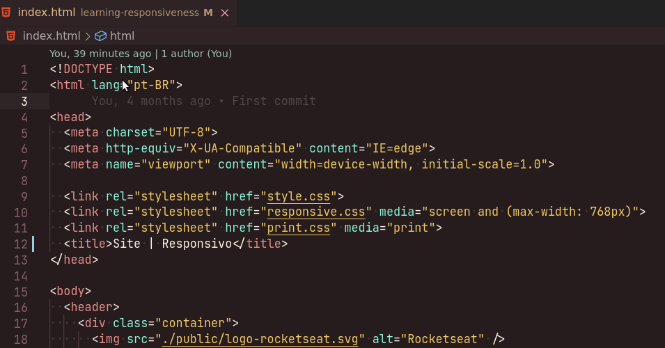

# About the Theme ❤️

The Ballerini Theme was made using the color palette [Ballerini](https://github.com/Ballerini-Server/BrandGuide). He is perfect for autumn lovers, with a more pastel tone.
## Contribution 💡

This theme was made exclusively for the members who are on our discord server. So in case, you find any errors or see a better form of ordinate colors. Feel free to join our [Discord Server](https://discord.gg/pDbY76q8Qf) to report or make a pull request.

If you want to help with the Ballerini Theme by adding a scope of your favorite language. Follow the contribution ways ->

1. Discover the scope:
To get the syntax background and foreground. Use a key `Ctrl + Shift + P` then `>Developer: Inspect Editor Tokens and Scopes`. It will open a screen that can inform about the syntax.

2. Adding in JSON:

### For more information 🏷️

* [Get Started with Color Themes on Visual Studio Code](https://code.visualstudio.com/docs/getstarted/themes)
* [More themes](https://themes.vscode.one)
* [Yo Code](https://vscode.readthedocs.io/en/latest/extensions/yocode/) 

**Enjoy!**

### Version 🎈

This theme is in version v1.0 Last Edited: 08/2021.